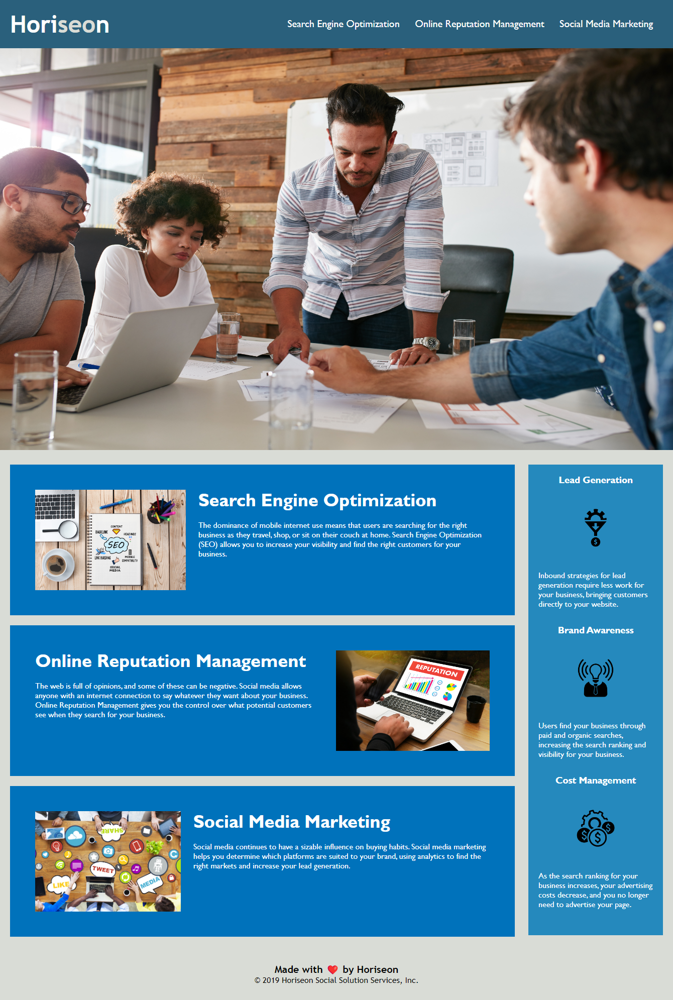

# HTML CSS Git Challenge: Code Refactor

[&#10159; Project website](https://cyphernyx.github.io/horiseon-accessibility-improvements/)

## Usage

A marketing agency WANTS a codebase that follows accessibility standards
SO THAT our own site is optimized for search engines

## Functionality Criteria

GIVEN a webpage meets accessibility standards:

- [x] WHEN I view the source code
      THEN I find semantic HTML elements
- [x] WHEN I view the structure of the HTML elements &nbsp;
      THEN I find that the elements follow a logical structure independent of styling and positioning
- [x] WHEN I view the image elements
      THEN I find accessible alt attributes
- [x] WHEN I view the heading attributes
      THEN they fall in sequential order
- [x] WHEN I view the title element
      THEN I find a concise, descriptive title

## Changelog

- Replaced &lt;div&gt; tags with semantic elements
- Reclassified and identified elements for more efficient styling
- Added **alt attributes** to images and title attributes to anchor tags
- Reorganized heading tags to follow hierarchy
- Replaced title tag to be more SEO friendly
- Condensed style.css: 21 CSS declaration blocks total &nbsp;down from 35 original declaration blocks

